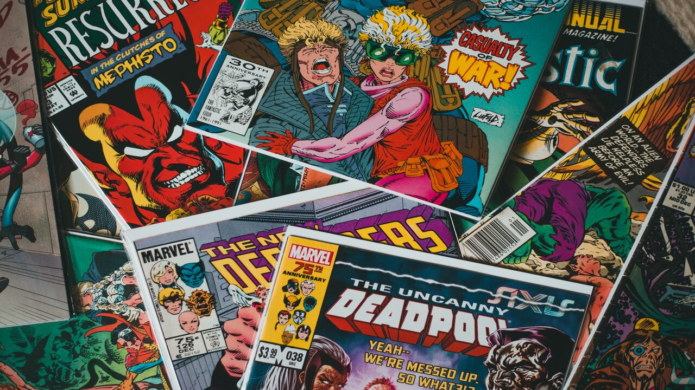
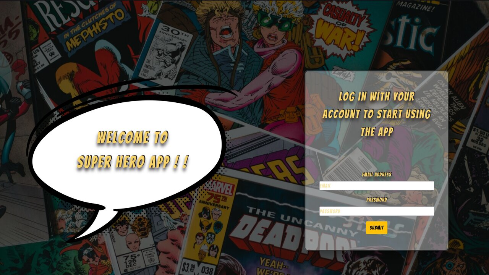
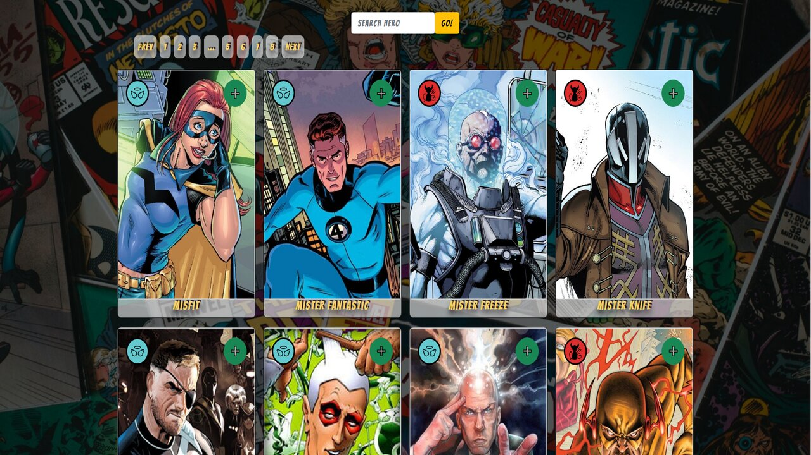
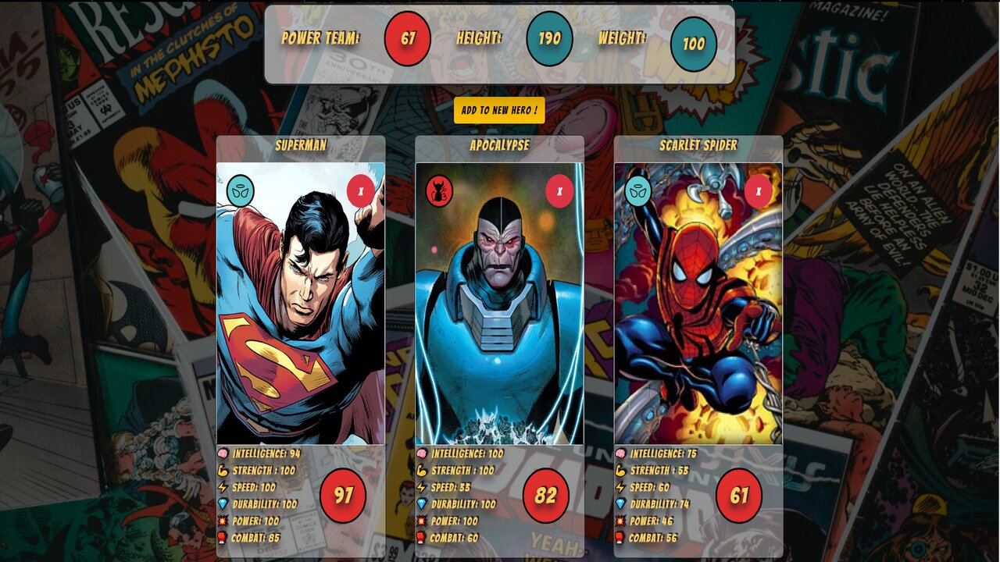
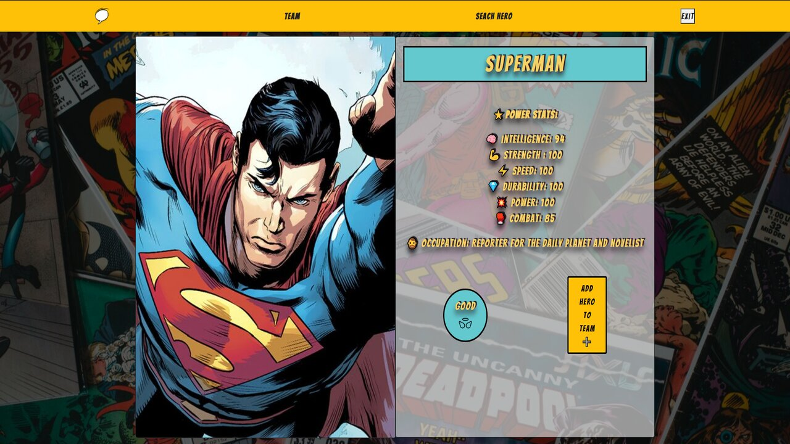
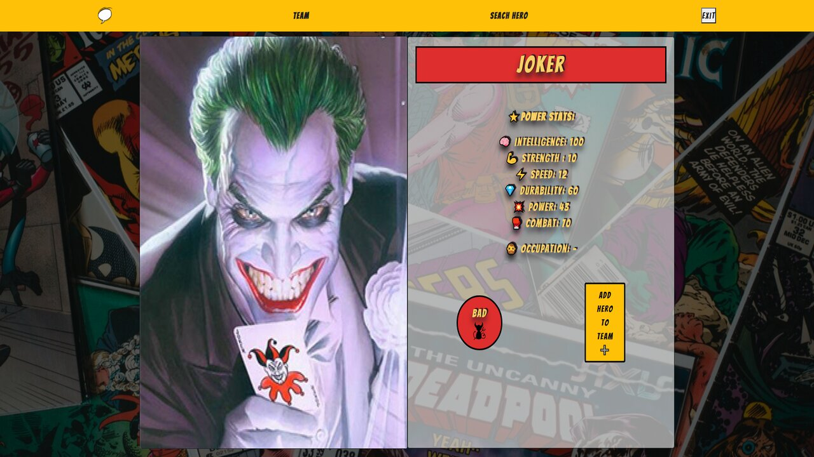

    

# Super Hero App
- Este proyecto es un challenge realizado con fines practicos, en el cual renderizo una api externa con super heroes. 
- La app me permite; buscar heroes y seleccionar un equipo de 6, estos pueden ser solo 3 de orientación buena y 3 de orientación mala. En el mismo apartado mostrar un promedio de stats totales del equipo, peso y altura. Ademas de poder ver detalles de heroes.
- Para usar la app de debe loguearse, el formulario controlado fue creado con formik.
- Los estilos fueron creadon con Boostrap y StyledComponent, es full responsive.

## Tecnologías utilizadas :computer: 

* __Javascript__
* __React - Redux__
* __Bootstrap__
* __StyledComponent__
 

## Previews 🌟

    

    

    

    

    

